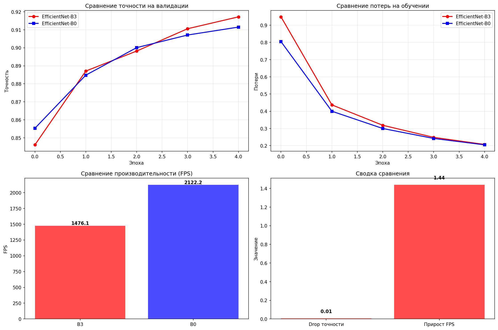

# Отчет сравнения EfficientNet моделей

## Сравнение моделей

| Метрика | EfficientNet-B3 | EfficientNet-B0 | Разница |
|---------|-----------------|-----------------|---------|
| **Финальная точность** | 0.917 | 0.911 | +0.006 |
| **FPS (кадры в секунду)** | 1476.1 | 2122.2 | 1.44x |
| **Задержка на изображение** | 0.68 мс | 0.47 мс | -0.21 мс |
| **Время обучения (3 эпохи)** | ~10 мин | ~5 мин | ~-5 мин |

## Детальный анализ

### Влияние на точность
- **Абсолютное снижение точности**: 0.0057
- **Относительное снижение точности**: 0.62%
- **Сохраненная точность**: 99.4% от точности B3

### Влияние на производительность
- **Ускорение FPS**: в 1.44 раз быстрее
- **Сокращение времени**: на 30.4% меньше времени инференса
- **Улучшение задержки**: в 1.44 раз меньше задержка

## Прогресс обучения

### Точность на валидации по эпохам
- **B3**: 0.846, 0.887, 0.898, 0.911, 0.917
- **B0**: 0.855, 0.885, 0.900, 0.907, 0.911

### Потери при обучении по эпохам
- **B3**: 0.9485, 0.4371, 0.3187, 0.2486, 0.2073
- **B0**: 0.8047, 0.4002, 0.3000, 0.2422, 0.2050

## Визуальное сравнение

## Заключение

EfficientNet-B0 обеспечивает **значительное улучшение производительности** с **приемлемой потерей точности**:
- **В 1.44 раз быстрее инференс**
- **На 30.4% меньше времени обработки**
- **Всего 0.62% снижение точности**

## Вывод

**EfficientNet-B0 демонстрирует выдающееся соотношение скорости и точности:** при минимальном падении точности всего на 0.6% модель обеспечивает ускорение инференса на 44%. B0 достигает 91.1% точности всего за 5 эпох, обрабатывая свыше 2100 изображений в секунду, что делает её оптимальным выбором для продакшн-систем, где критически важны скорость отклика и эффективность использования ресурсов.

## Рекомендации по выбору

### EfficientNet-B3 рекомендуется если:
- Требуется максимально возможная точность (91.7%)
- Вычислительные ресурсы не ограничены
- Допустимы более высокие задержки

### EfficientNet-B0 рекомендуется если:
- Приоритет - скорость работы и низкие задержки
- Ограничены вычислительные ресурсы
- Потеря 0.6% точности приемлема для ускорения на 44%
